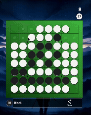

# 感謝

本網站使用Jekyll開發。主題使用Gitbook theme（欲知更多詳情，請點擊上方icon）。

# 網址
* [成果網站](https://3epiossi.github.io)
* [源代碼發布](https://github.com/3epiossi/3epiossi.github.io)

# About Me
* 21歲，是個學生 (ん
  * 
* 中正通訊[NEAT Lab](https://www.neatlab.tw/Home)的專題生
  * 
* [中正瓶蓋棒球社](https://www.instagram.com/ccu_capbaseball_club/)的社員
  * 
* 洋基隊球迷
  * {:height="30%" width="30%"}
* [黑白棋](https://line.me/ti/g2/bn7jOjxrBL1dZEJZD1UmV2MjzhbmenUbf6azlA?utm_source=invitation&utm_medium=link_copy&utm_campaign=default)玩家
  * 
